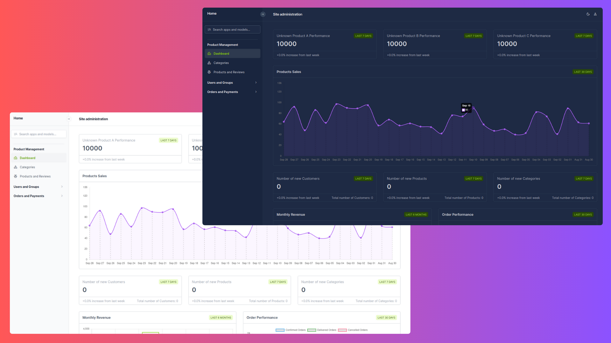

# AGAVI - The Modern eCommerce Platform

This a modern eCommerce platform tailored for small to mid-sized businesses, offering seamless management of products, orders, and categories through a custom Unfold Admin dashboard. Built with Django REST Framework, it includes JWT-based cookie authentication, Razorpay integration for payments, and Cloudinary for media storage. The platform provides consistent API responses, robust error handling, and efficient pagination, all deployed on Vercel with CockroachDB as the database. It delivers an ideal solution for businesses seeking a reliable, maintainable, and scalable online presence.

## Why I Built This Project?

I developed this eCommerce backend platform after struggling to find a reliable, open-source solution built with Django REST Framework for a freelancing project. Most options were incomplete or poorly structured, with messy function-based views and lacking key features like Cash on Delivery (COD) payments, essential for my region. Many projects were also just tutorial-based, with little real-world application. Seeing this gap, I decided to build a solution that prioritizes clean, maintainable code and meets practical eCommerce needs.

## Table of contents

-   [Tech Stack](#tech-stack)
-   [Installation](#installation)
-   [Features](#features)
-   [API Documentation](#api-documentation)

    -   [Accounts App](#accounts-app)
    -   [Products App](#products-app)
    -   [Cart App](#cart-app)
    -   [Checkout App](#checkout-app)

-   [License](#license)
-   [Roadmap](#roadmap)

## Tech Stack

The project utilizes a variety of modern technologies and services to ensure scalability, maintainability, nad performance. Below is a list of key technologies used and **ALL OF THEM ARE EITHER FREE OR HAVE GREAT FREE TIER**:

-   [**Django REST Framework**](https://www.django-rest-framework.org/) - A powerful toolkit for building Web APIs in Django.
-   [**Unfold Admin**](https://unfoldadmin.com/) - A package for customizing the Django admin interface with enhanced UX and UI.
-   [**CockroachDB**](https://www.cockroachlabs.com/) - A distributed SQL database that scales horizontally and provides high resilience.
-   [**Cloudinary**](https://cloudinary.com/) - A cloud-based media management platform that offers image and video optimization.
-   [**Razorpay**](https://razorpay.com/) - A payment gateway that enables online transactions with secure and seamless payment processing.
-   [**Vercel**](https://vercel.com/) - A platform for deploying front-end applications and serverless functions seamlessly but supports Python runtime as well.

## Installation

-   Clone the repository:
    ```bash
    git clone https://github.com/0neTrueG0D/agavi-backend.git
    ```
-   Install the dependencies:
    ```bash
    pip install -r requirements.txt
    ```
-   Set up the environment variables:

    ```bash
    # Create a .env file in the root directory and add the following variables:

    ENV=DEV

    SECRET_KEY="your_secret_key_here"
    ALLOWED_HOSTS="127.0.0.1,localhost,.cloudflarestorage.com,.vercel.app,your_custom_domain.com"

    COCKROACH_DB_NAME=defaultdb
    COCKROACH_DB_USER=user_name
    COCKROACH_DB_PASS=user_password
    COCKROACH_DB_HOST=free-tier.gcp-us-central1.cockroachlabs.cloud
    COCKROACH_DB_PORT=26257

    CLOUDINARY_CLOUD_NAME=your_cloud_name
    CLOUDINARY_API_KEY=your_api_key
    CLOUDINARY_API_SECRET=your_api_secret

    ```

-   If you are using CockroachDB, you can create a free-tier cluster on CockroachCloud and get the connection details from the CockroachCloud dashboard. Or you can use any other database of your choice like SQLite for quick setup.
-   Run the migrations:
    ```bash
    python manage.py makemigrations
    python manage.py migrate
    ```
-   Create a superuser:
    ```bash
    python manage.py createsuperuser
    ```
-   Run the development server:
    ```bash
    python manage.py runserver
    ```

## Features

This project is a comprehensive, full-featured e-commerce solution designed for small to mid-sized businesses looking to establish or scale their online presence. The system focuses on ease of management for individual sellers and small teams, with a clear distinction between administrative and user functionalities. The platform is built to ensure high maintainability, scalability, and robust performance, all while maintaining a smooth user experience. **Note:** Product and category creation and management are restricted to administrators, making this platform ideal for businesses where a central admin oversees the product catalog.

### 1. **Unfold Admin with Custom Dashboard**

The application leverages the powerful **django-unfold** package to deliver an intuitive and data-rich admin dashboard. This custom dashboard is designed to give administrators quick and actionable insights into business performance:

-   **Product Sales Chart:** Visualizes sales data to show how individual products are performing.
-   **Monthly Revenue Chart:** Provides a comprehensive view of monthly earnings, helping administrators track revenue trends over time.
-   **Order Performance Chart:** Displays the total number of orders and highlights changes in order volumes to help gauge customer activity.
-   **Top 3 Best-Selling Products Cards:** Highlights the three best-performing products, giving a quick glance at what's driving sales.
-   **New Customers Data Card:** Summarizes recent customer sign-ups, offering insights into the growing customer base.
-   **New Products Data Card:** Displays data on recently added products, keeping administrators informed of new inventory.
-   **New Categories Data Card:** Provides a summary of new product categories, giving an overview of catalog diversification.

### 2. **Custom JWT Authentication with Cookie-Based Storage**

-   Implements a secure authentication mechanism using JWT, with access and refresh tokens stored in secure HTTP-only cookies. This approach combines the stateless benefits of token-based authentication with enhanced security practices for user session management.

### 3. **Consistent and Customizable API Responses**

-   All API endpoints return standardized response formats with custom helper functions for handling both successful and error states. This ensures uniformity across the entire platform, simplifies error management, and enhances the user experience on the front-end by providing clear feedback.

### 4. **Cloudinary for Media Storage**

-   Utilizes Cloudinary for all media storage, ensuring fast and reliable hosting of images and media assets. Cloudinary\u2019s built-in transformation tools allow for automatic optimization of media, improving page load times and overall performance.

### 5. **Integrated Payment Systems: Razorpay and Cash on Delivery (COD)**

-   The application integrates Razorpay for seamless online payments, enabling secure transactions between customers and the platform. Additionally, a Cash on Delivery (COD) option is available, allowing for greater flexibility and accessibility for users who prefer offline payment methods.

### 6. **Advanced Product Review System**

-   Enables users to leave reviews for products they have purchased, improving customer engagement and providing valuable feedback to store owners. Administrators maintain full control over reviews, allowing for easy moderation to ensure only relevant and appropriate content is displayed.

### 7. **Custom Pagination for All List Views**

-   All list-based views are paginated using a custom class designed for flexibility. It supports customizable page sizes and default sorting by the `created_at` field, ensuring recent entries are always surfaced first.

### 8. **Comprehensive Cart and Order Management**

-   Offers a full suite of cart and order management features, including adding, updating, and removing items from the cart. The cart logic ensures that the same product cannot be added multiple times, even by administrators.
-   Orders are fully manageable, with the ability to update only the shipping address post-purchase, cancel, or return orders, ensuring users have the flexibility to manage their purchases.

### 9. **Admin-Only Product and Category Management**

-   Products and categories can only be created, updated, or deleted by administrators. This centralized management approach is perfect for small businesses or individual sellers who need full control over their product catalog and inventory.
-   Users can view and purchase products, but they cannot modify the product catalog, or become a seller on the platform.

### 10. **Whitenoise for Static Files Management**

-   The application uses Whitenoise to serve static files in production environments, reducing server load and improving the overall performance of the website. This ensures that assets such as stylesheets and JavaScript files are delivered quickly and efficiently to users.

### 11. **Error Handling and Validation**

-   Features robust error handling throughout the application, providing meaningful feedback for both successful and erroneous operations. This ensures smooth functionality and enhances the user experience by catching and resolving issues promptly.

### 12. **Use of ViewSets for Maintainability**

-   The project takes advantage of Django REST Framework\u2019s ViewSets, which provide a structured and maintainable way to handle API endpoints. ViewSets minimize code redundancy by automatically routing requests to the appropriate view methods based on HTTP methods, making it easier to scale and extend the application.

## API Documentation

This documentation provides an overview of the API endpoints for the application, categorized by functionality. The API follows RESTful principles and is organized into various sections. Each section contains a list of endpoints, along with their descriptions, request bodies, and responses.

### _Table of Contents_

-   #### [_Accounts App_](#accounts-app)

    -   [**User Registration and Authentication**](#user-registration-and-authentication)
        -   [Register User](#register-user)
        -   [Login User](#login-user)
        -   [Logout User](#logout-user)
    -   [**User Profile Management**](#user-profile-management)
        -   [Retrieve User Profile](#retrieve-user-profile)
        -   [Update User Profile](#update-user-profile)
        -   [Delete User Profile](#delete-user-profile)
    -   [**Address Management**](#address-management)
        -   [List User Addresses](#list-user-addresses)
        -   [Create User Address](#create-user-address)
        -   [Retrieve User Address](#retrieve-user-address)
        -   [Update User Address](#update-user-address)
        -   [Delete User Address](#delete-user-address)

-   #### [_Products App_](#products-app)

    -   [**Product Management**](#product-management)
        -   [List Products](#list-products)
        -   [Retrieve Product](#retrieve-product)
    -   [**Review Management**](#review-management)
        -   [List Reviews](#list-reviews)
        -   [Create Review](#create-review)
        -   [Retrieve Review](#retrieve-review)
        -   [Update Review](#update-review)
        -   [Delete Review](#delete-review)
    -   [**Category Management**](#category-management)
        -   [List Categories](#list-categories)
        -   [List Featured Categories](#list-featured-categories)
        -   [List Products by Category](#list-products-by-category)

-   #### [_Cart App_](#cart-app)

    -   [**Cart Management**](#cart-management)
        -   [Retrieve Cart](#retrieve-cart)
        -   [Add to Cart](#add-to-cart)
        -   [Update Cart Item](#update-cart-item)
        -   [Remove Cart Item](#remove-cart-item)
        -   [Clear Cart](#clear-cart)

-   #### [_Checkout App_](#checkout-app)

    -   [**Order Management**](#order-management)
        -   [List Orders](#list-orders)
        -   [Create Order](#create-order)
        -   [Retrieve Order](#retrieve-order)
        -   [Update Order](#update-order)
        -   [Cancel Order](#cancel-order)
        -   [Return Order](#return-order)
    -   [**Payment Management**](#payment-management)
        -   [Create Payment](#create-payment)
        -   [Verify Payment](#verify-payment)
        -   [Retrieve Payment](#retrieve-payment)

## Accounts App

### User Registration and Authentication

-   #### Register User

    -   **URL:** `/api/v1/account/register/`
    -   **Method:** `POST`
    -   **Description:** Register a new user.
    -   **Request Body:**

        ```json
        {
            "username": "string",
            "email": "string",
            "password": "string"
        }
        ```

    -   **Responses:**
        -   `201 Created` - User registered successfully.
        -   `403 Forbidden` - User already logged in or username/email already exists.
        -   `400 Bad Request` - Validation errors.

-   #### Login User

    -   **URL:** `/api/v1/account/login/`
    -   **Method:** `POST`
    -   **Description:** Log in a user.
    -   **Request Body:**

        ```json
        {
            "username": "string",
            "password": "string"
        }
        ```

    -   **Responses:**
        -   `200 OK` - Login successful.
        -   `403 Forbidden` - User already logged in.
        -   `404 Not Found` - User not found or invalid credentials.
        -   `400 Bad Request` - Validation errors.

-   #### Logout User

    -   **URL:** `/api/v1/account/logout/`
    -   **Method:** `POST`
    -   **Description:** Log out the currently logged-in user.
    -   **Responses:**
        -   `200 OK` - Logout successful.
        -   `403 Forbidden` - User not logged in.

### User Profile Management

-   #### Retrieve User Profile

    -   **URL:** `/api/v1/profile/`
    -   **Method:** `GET`
    -   **Description:** Retrieve the logged-in user's profile information.
    -   **Responses:**
        -   `200 OK` - User profile details.

-   #### Update User Profile

    -   **URL:** `/api/v1/profile/update/`
    -   **Method:** `PUT`
    -   **Description:** Update the logged-in user's profile information.
    -   **Request Body:**

        ```json
        {
            "username": "string",
            "email": "string",
            "password": "string"
        }
        ```

    -   **Responses:**
        -   `200 OK` - User profile updated successfully.

-   #### Delete User Profile

    -   **URL:** `/api/v1/profile/delete/`
    -   **Method:** `DELETE`
    -   **Description:** Delete the logged-in user's profile.
    -   **Request Body:**

        ```json
        {
            "password": "string"
        }
        ```

    -   **Responses:**
        -   `204 No Content` - User profile deleted successfully.

### Address Management

-   #### List User Addresses

    -   **URL:** `/api/v1/addresses/`
    -   **Method:** `GET`
    -   **Description:** Retrieve a list of addresses for the logged-in user.
    -   **Responses:**
        -   `200 OK` - List of user addresses.

-   #### Create User Address

    -   **URL:** `/api/v1/addresses/create/`
    -   **Method:** `POST`
    -   **Description:** Create a new address for the logged-in user.
    -   **Request Body:**

        ```json
        {
            "name": "string",
            "phone_number": "string",
            "street": "string",
            "landmark": "string",
            "city": "string",
            "state": "string",
            "pin_code": "string"
        }
        ```

    -   **Responses:**
        -   `201 Created` - Address created successfully.

-   #### Retrieve User Address

    -   **URL:** `/api/v1/addresses/<int:pk>/`
    -   **Method:** `GET`
    -   **Description:** Retrieve a specific address by ID.
    -   **Responses:**
        -   `200 OK` - Address details.
        -   `404 Not Found` - Address not found.

-   #### Update User Address

    -   **URL:** `/api/v1/addresses/<int:pk>/update/`
    -   **Method:** `PUT`
    -   **Description:** Update a specific user address.
    -   **Request Body:**

        ```json
        {
            "name": "string",
            "phone_number": "string",
            "street": "string",
            "landmark": "string",
            "city": "string",
            "state": "string",
            "pin_code": "string"
        }
        ```

    -   **Responses:**
        -   `200 OK` - Address updated successfully.
        -   `404 Not Found` - Address not found.

-   #### Delete User Address

    -   **URL:** `/api/v1/addresses/<int:pk>/delete/`
    -   **Method:** `DELETE`
    -   **Description:** Delete a specific user address.
    -   **Responses:**
        -   `204 No Content` - Address deleted successfully.
        -   `404 Not Found` - Address not found.

## Products App

### Product Management

-   #### List Products

    -   **URL:** `/api/v1/products/`
    -   **Method:** `GET`
    -   **Description:** Retrieve a list of all products.
    -   **Responses:**
        -   `200 OK` - List of products.

-   #### Retrieve Product

    -   **URL:** `/api/v1/products/<int:pk>/`
    -   **Method:** `GET`
    -   **Description:** Retrieve details of a specific product by ID.
    -   **Responses:**
        -   `200 OK` - Product details.
        -   `404 Not Found` - Product not found.

### Review Management

-   #### List Reviews

    -   **URL:** `/api/v1/products/<int:product_id>/reviews/`
    -   **Method:** `GET`
    -   **Description:** Retrieve reviews for a specific product.
    -   **Responses:**
        -   `200 OK` - List of reviews.

-   #### Create Review

    -   **URL:** `/api/v1/products/<int:product_id>/reviews/create/`
    -   **Method:** `POST`
    -   **Description:** Create a new review for a specific product.
    -   **Request Body:**

        ```json
        {
            "rating": "integer",
            "comment": "string"
        }
        ```

    -   **Responses:**
        -   `201 Created` - Review created successfully.
        -   `400 Bad Request` - Validation errors.

-   #### Retrieve Review

    -   **URL:** `/api/v1/reviews/<int:pk>/`
    -   **Method:** `GET`
    -   **Description:** Retrieve details of a specific review.
    -   **Responses:**
        -   `200 OK` - Review details.
        -   `404 Not Found` - Review not found.

-   #### Update Review

    -   **URL:** `/api/v1/reviews/<int:pk>/update/`
    -   **Method:** `PUT`
    -   **Description:** Update a specific review.
    -   **Request Body:**

        ```json
        {
            "rating": "integer",
            "comment": "string"
        }
        ```

    -   **Responses:**
        -   `200 OK` - Review updated successfully.
        -   `404 Not Found` - Review not found.

-   #### Delete Review

    -   **URL:** `/api/v1/reviews/<int:pk>/delete/`
    -   **Method:** `DELETE`
    -   **Description:** Delete a specific review.
    -   **Responses:**
    -   `204 No Content` - Review deleted successfully.
    -   `404 Not Found` - Review not found.

### Category Management

-   #### List Categories

    -   **URL:** `/api/v1/categories/`
    -   **Method:** `GET`
    -   **Description:** Retrieve a list of all categories.
    -   **Responses:**
        -   `200 OK` - List of categories.

-   #### List Featured Categories

    -   **URL:** `/api/v1/categories/featured/`
    -   **Method:** `GET`
    -   **Description:** Retrieve a list of featured categories.
    -   **Responses:**
        -   `200 OK` - List of featured categories.

-   #### List Products by Category

    -   **URL:** `/api/v1/categories/<slug:category_slug>/products/`
    -   **Method:** `GET`
    -   **Description:** Retrieve products in a specific category.
    -   **Responses:**
        -   `200 OK` - List of products in the category.

## Cart App

### Cart Management

-   #### Retrieve Cart

    -   **URL:** `/api/v1/cart/`
    -   **Method:** `GET`
    -   **Description:** Retrieve the contents of the user's cart.
    -   **Responses:**
        -   `200 OK` - Cart details.

-   #### Add to Cart

    -   **URL:** `/api/v1/cart/add/`
    -   **Method:** `POST`
    -   **Description:** Add a product to the user's cart.
    -   **Request Body:**

        ```json
        {
            "product": "integer",
            "quantity": "integer"
        }
        ```

    -   **Responses:**
        -   `201 Created` - Product added to cart.

-   #### Update Cart Item

    -   **URL:** `/api/v1/cart/<int:pk>/update/`
    -   **Method:** `PUT`
    -   **Description:** Update the quantity of a specific cart item.
    -   **Request Body:**

        ```json
        {
            "quantity": "integer"
        }
        ```

    -   **Responses:**
        -   `200 OK` - Cart item updated successfully.
        -   `404 Not Found` - Cart item not found.

-   #### Remove Cart Item

    -   **URL:** `/api/v1/cart/<int:pk>/remove/`
    -   **Method:** `DELETE`
    -   **Description:** Remove a specific item from the cart.
    -   **Responses:**
        -   `204 No Content` - Cart item removed successfully.
        -   `404 Not Found` - Cart item not found.

-   #### Clear Cart

    -   **URL:** `/api/v1/cart/clear/`
    -   **Method:** `DELETE`
    -   **Description:** Clear all items from the cart.
    -   **Responses:**
        -   `204 No Content` - Cart cleared successfully.

## Checkout App

## Order Management

-   #### List Orders

    -   **URL:** `/api/v1/checkout/orders/`
    -   **Method:** `GET`
    -   **Description:** Retrieve a list of orders for the logged-in user.
    -   **Responses:**
        -   `200 OK` - List of orders.

-   #### Create Order

    -   **URL:** `/api/v1/checkout/orders/create/`
    -   **Method:** `POST`
    -   **Description:** Create a new order. User must have items in the cart.
    -   **Request Body:**

        ```json
        {
            "shipping_address": "integer",
            "billing_address": "integer"
        }
        ```

    -   **Responses:**
        -   `201 Created` - Order created successfully.

-   #### Retrieve Order

    -   **URL:** `/api/v1/checkout/orders/<int:pk>/`
    -   **Method:** `GET`
    -   **Description:** Retrieve details of a specific order.
    -   **Responses:**
        -   `200 OK` - Order details.
        -   `404 Not Found` - Order not found.

-   #### Update Order

    _***URL:***_ `/api/v1/checkout/orders/<int:pk>/update/`

    -   **Method:** `PUT`
    -   **Description:** Update the shipping address of a specific order.
    -   **Request Body:**

        ```json
        {
            "shipping_address": "integer"
        }
        ```

    -   **Responses:**
        -   `200 OK` - Order updated successfully.
        -   `404 Not Found` - Order not found.

-   #### Cancel Order

    -   **URL:** `/api/v1/checkout/orders/<int:pk>/cancel/`
    -   **Method:** `PUT`
    -   **Description:** Cancel a specific order.
    -   **Responses:**
        -   `200 OK` - Order canceled successfully.
        -   `404 Not Found` - Order not found.

-   #### Return Order

    -   **URL:** `/api/v1/checkout/orders/<int:pk>/return/`
    -   **Method:** `PUT`
    -   **Description:** Return a specific order. Only initiates the return process.
    -   **Responses:**
        -   `200 OK` - Order returned successfully.
        -   `404 Not Found` - Order not found.

### Payment Management

-   #### Create Payment

    -   **URL:** `/api/v1/checkout/payments/create/`
    -   **Method:** `POST`
    -   **Description:** Create a new payment for an order.
    -   **Request Body:**

        ```json
        {
            "order": "integer",
            "method": "string"
        }
        ```

    -   **Responses:**
        -   `201 Created` - Payment created successfully.

-   #### Verify Payment

    -   **URL:** /api/v1/checkout/payments/verify/
    -   **Method:** `PUT`
    -   **Description:** Verify a payment. This endpoint is used by the only by the payment gateway (razorpay) to verify the payment status.
    -   **Request Body:**

        ```json
        {
            "payment": "string",
            "order": "integer"
        }
        ```

    -   **Responses:**
        -   `200 OK` - Payment verified successfully.

-   #### Retrieve Payment

    -   **URL:** `/api/v1/checkout/payments/<int:order_id>/`
    -   **Method:** `GET`
    -   **Description:** Retrieve payment details for a specific order.
    -   **Responses:**
        -   `200 OK` - Payment details.
        -   `404 Not Found` - Payment not found.

## License

This project is licensed under the slightly modified MIT License - see the [LICENSE](LICENSE) file for details.

## Roadmap

-   [x] Initial project setup
-   [x] User authentication and authorization
-   [x] Product and category management
-   [x] Cart and order management
-   [x] Payment integration with Razorpay
-   [x] Cloudinary integration for media storage
-   [x] Custom Unfold Admin dashboard
-   [x] API documentation
-   [ ] Email notifications
-   [ ] Oauth2 authentication
-   [ ] Automated tests
-   [ ] Scalability improvements
-   [ ] Additional payment gateways
-   [ ] Performance optimization
